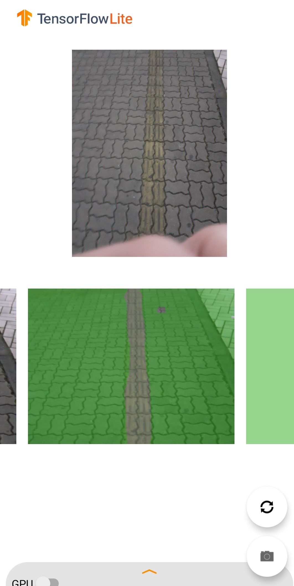
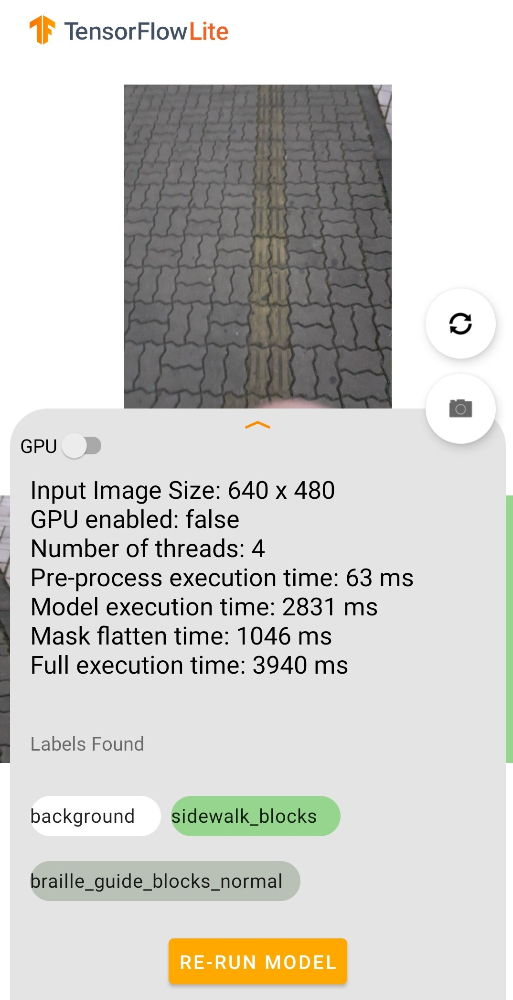

### 안드로이드 스튜디오

- Using reference https://www.tensorflow.org/lite/examples/segmentation/overview
- 변경할 부분
```kotlin
// android\lib_utils\src\main\java\org\tensorflow\lite\examples\imagesegmentation\utils\ImageUtils.kt
//153 line (bitmapToByteBuffer function change)
fun bitmapToByteBuffer(
      bitmapIn: Bitmap,
      width: Int,
      height: Int,
      mean: Float = 0.0f,
      std: Float = 255.0f
    ): ByteBuffer {
      val bitmap = scaleBitmapAndKeepRatio(bitmapIn, height, width)
      val inputImage = ByteBuffer.allocateDirect(1 * width * height * 3 * 4)
      inputImage.order(ByteOrder.nativeOrder())
      inputImage.rewind()

      val intValues = IntArray(width * height)
      bitmap.getPixels(intValues, 0, width, 0, 0, width, height)
      for (z in 0..2) {
        var pixel = 0
        for (y in 0 until height) {
          for (x in 0 until width) {
            val value = intValues[pixel++]
            // Normalize channel values to [-1.0, 1.0]. This requirement varies by
            // model. For example, some models might require values to be normalized
            // to the range [0.0, 1.0] instead.
            if (z == 0) {
              inputImage.putFloat(((value shr 16 and 0xFF) - mean) / std)
            } else if (z == 1) {
              inputImage.putFloat(((value shr 8 and 0xFF) - mean) / std)
            } else if (z == 2) {
              inputImage.putFloat(((value and 0xFF) - mean) / std)
            }
          }
        }
      }
        inputImage.rewind()
        return inputImage
    }
```

- 개선점
  - 촬영 버튼 제거 및 코루틴을 이용한 영상화
  - 후처리


- 2021-12-13
  
  